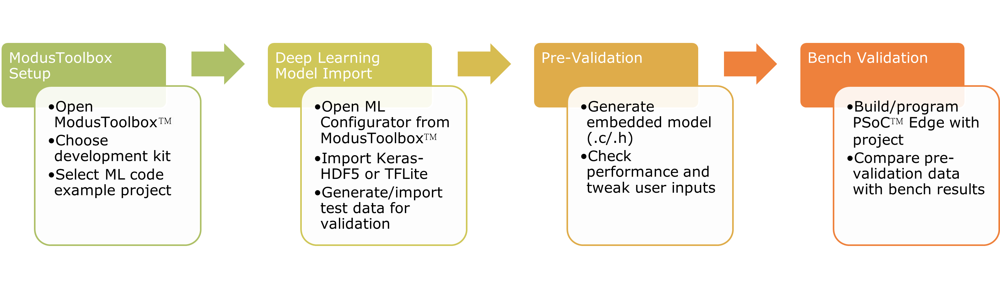
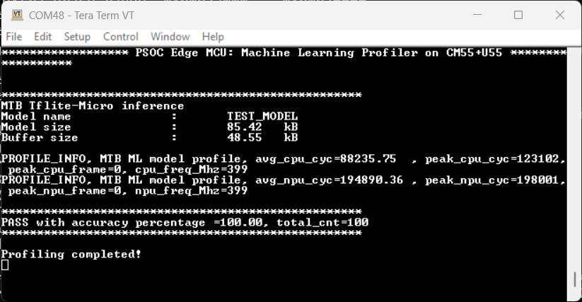
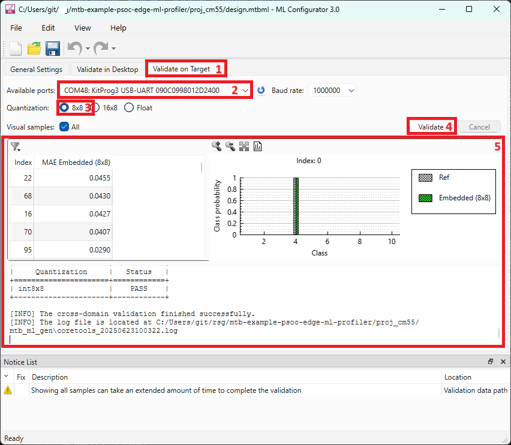

# PSOC&trade; Edge MCU: Machine learning profiler

This code example demonstrates how to use the ModusToolbox&trade; Machine Learning (ModusToolbox&trade;-ML) development flow on PSOC&trade; Edge MCU, where you can have a pre-trained neural network (NN) model, which can be profiled and validated on the PC and target device.

Import a pre-trained model using the ModusToolbox&trade;-ML Configurator tool, create an embedded, optimized version of this model, and validate the performance on the PC. After this, the validation data files can be integrated with this code example or streamed to the device (default option), so you can run the same validation data and profile performance when the ML model is deployed on the PSOC&trade; Edge MCU. You can also select where to deploy and run the model:
- **High-performance domain:** Uses the Arm&reg; Cortex&reg;-M55 and the Ethos-U55 processor
- **Low-power domain:** Uses the Arm&reg; Cortex&reg;-M33 and the NNLITE processor

**Figure 1. ModusToolbox&trade;-ML development flow**

For details about the ModusToolbox&trade; machine learning solution, see the [ModusToolbox&trade; for Machine Learning](https://www.infineon.com/cms/en/design-support/tools/sdk/modustoolbox-software/modustoolbox-machine-learning/).

This code example has a three project structure: CM33 secure, CM33 non-secure, and CM55 projects. All three projects are programmed to the external QSPI flash and executed in Execute in Place (XIP) mode. Extended boot launches the CM33 secure project from a fixed location in the external flash, which then configures the protection settings and launches the CM33 non-secure application. Additionally, CM33 non-secure application enables CM55 CPU and launches the CM55 application.

[View this README on GitHub.](https://github.com/Infineon/mtb-example-psoc-edge-ml-profiler)

[Provide feedback on this code example.](https://yourvoice.infineon.com/jfe/form/SV_1NTns53sK2yiljn?Q_EED=eyJVbmlxdWUgRG9jIElkIjoiQ0UyMzg4MjciLCJTcGVjIE51bWJlciI6IjAwMi0zODgyNyIsIkRvYyBUaXRsZSI6IlBTT0MmdHJhZGU7IEVkZ2UgTUNVOiBNYWNoaW5lIGxlYXJuaW5nIHByb2ZpbGVyIiwicmlkIjoicm9kb2xmby5sb3NzaW9AaW5maW5lb24uY29tIiwiRG9jIHZlcnNpb24iOiIyLjMuMCIsIkRvYyBMYW5ndWFnZSI6IkVuZ2xpc2giLCJEb2MgRGl2aXNpb24iOiJNQ0QiLCJEb2MgQlUiOiJJQ1ciLCJEb2MgRmFtaWx5IjoiUFNPQyJ9)

See the [Design and implementation](docs/design_and_implementation.md) for the functional description of this code example.

## Requirements

- [ModusToolbox&trade;](https://www.infineon.com/modustoolbox) v3.7 or later (tested with v3.7)
- [ModusToolbox&trade; Machine Learning Pack](https://softwaretools.infineon.com/tools/com.ifx.tb.tool.modustoolboxpackmachinelearning) v3.0 or later (tested with v3.0)
- Board support package (BSP) minimum required version: 1.0.0
- Programming language: C
- Associated parts: All [PSOC&trade; Edge MCU](https://www.infineon.com/products/microcontroller/32-bit-psoc-arm-cortex/32-bit-psoc-edge-arm) parts

## Supported toolchains (make variable 'TOOLCHAIN')

- GNU Arm&reg; Embedded Compiler v14.2.1 (`GCC_ARM`) – Default value of `TOOLCHAIN`
- Arm&reg; Compiler v6.22 (`ARM`)
- LLVM Embedded Toolchain for Arm&reg; v19.1.5 (`LLVM_ARM`)

> **Note** IAR is not supported by the TensorFlow Lite for Microcontrollers (TFLM) library.

## Supported kits (make variable 'TARGET')

- [PSOC&trade; Edge E84 Evaluation Kit](https://www.infineon.com/KIT_PSE84_EVAL) (`KIT_PSE84_EVAL_EPC2`) – Default value of `TARGET`
- [PSOC&trade; Edge E84 Evaluation Kit](https://www.infineon.com/KIT_PSE84_EVAL) (`KIT_PSE84_EVAL_EPC4`)
- [PSOC&trade; Edge E84 AI Kit](https://www.infineon.com/KIT_PSE84_AI) (`KIT_PSE84_AI`)

## Hardware setup

This example uses the board's default configuration. See the kit user guide to ensure that the board is configured correctly.

Ensure the following jumper and pin configuration on board.
- BOOT SW must be in the HIGH/ON position
- J20 and J21 must be in the tristate/not connected (NC) position

> **Note:** This hardware setup is not required for KIT_PSE84_AI.

## Software setup

See the [ModusToolbox&trade; tools package installation guide](https://www.infineon.com/ModusToolboxInstallguide) for information about installing and configuring the tools package.

Install a terminal emulator if you do not have one. Instructions in this document use [Tera Term](https://teratermproject.github.io/index-en.html).

Install the Machine Learning pack using this [link](https://softwaretools.infineon.com/tools/com.ifx.tb.tool.modustoolboxpackmachinelearning). Alternatively, use the [Infineon Developer Center (IDC)](https://www.infineon.com/cms/en/design-support/tools/utilities/infineon-developer-center-idc-launcher/) launcher and search for `ModusToolbox Machine Learning Pack` and install it.

Use the ModusToolbox&trade;-ML configurator executable (from *{ModusToolbox&trade; software install directory}/packs/ModusToolbox-Machine-Learning-Pack/tools/ml-configurator/*) or launch it from the Eclipse IDE Quick Launch window to generate model C files. This generated application does not provide a `make ml-configurator` target. The terrain deployment variants can instead be reproduced with `python3 tools/generate_terrain_artifacts.py`; see `deployment/README.md` for the exact workflow. For more information, see the [*ModusToolbox&trade; machine learning user guide*](https://www.infineon.com/ModusToolboxMLUserGuide).

By default, the *Makefile* for the Arm&reg; Cortex&reg;-M55 and Arm&reg; Cortex&reg;-M33 uses a model that comes with the code example. The pre-trained NN model is located in the *pretrained_models* folder. You can use the ModusToolbox&trade;-ML Configurator to link to this file or load another model file and generate C files for the target device.

- **proj_cm55/Makefile:** Uses the RESNET model located at *proj_cm55/pretrained_models/*
- **proj_cm33_ns/Makefile:** Uses the SMALL_MLP_MNIST model located at *proj_cm33_ns/pretrained_models/*

By default, the output file location is set to *mtb_ml_gen*. The project name is set to *TEST_MODEL*. If you change any of these default settings, edit the following *Makefile* parameters of this code example:

 Makefile parameter | Description
 :--------   | :--------
 `NN_TYPE=`  | Defines the input data format and NN weights. It can be `float`, `int16x8`, or `int8x8`. The integer types indicate (input/output) x (weights) quantization
 `NN_MODEL_NAME=` | Defines the name of the model. The name comes from the *project name* defined in the ML Configurator tool. Do not use quotes when changing the name of the model
 `NN_MODEL_FOLDER=` | Sets the name where the model files will be placed. The name comes from the *output file location* defined in the ModusToolbox&trade;-ML Configurator tool
 `NN_INFERENCE_ENGINE` | Defines the inference engine to run. It has two options: `tflm` or `tflm_less`. Note that Ethos-U55 does not support the `tflm_less` option
 `NN_NPU_ENABLE` | Enables the NNLITE NPU. Only available for the CM33 project
 `NN_RNN_MODEL` | Defines if the profiled model is RNN type

 

There are two *design.mtbml* files in this code example:
- *proj_cm55/design.mtbml*
- *proj_cm33_ns/design.mtbml*

Choose one design and open it with the ModusToolbox&trade;-ML Configurator tool. To validate the given model with the tool, click the **Validate in Desktop** tab. By default, the project uses the testing data stored in the file located at *sample_data/* folder. If *Enable model quantization* is checked, the project uses calibration data stored in the file also located at *sample_data/* folder.

Alternatively, you can use a random dataset structure to validate the model. You can click the **Validate** button to initiate the validation. Note that this will generate the regression data files that can be stored in the internal memory of the target device. Therefore, limit the sample count to '100' in the ModusToolbox&trade;-ML Configurator tool. Note that validation in the desktop is not available for Ethos-U55.

You can also stream the test data to the device by clicking the **Validate on Target**. In this scheme, the regression data files are not stored in the internal memory, so you can work with a larger dataset. It uses the UART to stream the data. Note that validation in the target is always available; regardless of the target platform.

By default, this code example sets the UART baudrate at 1 Mbps when streaming data to the device. ModusToolbox&trade;-ML Configurator tool has the option to change the baudrate under the *Validation on Target* tab. Ensure that the baudrate configured in the ModusToolbox&trade;-ML Configurator matches the value passed as an argument for the `app_retarget_io_init()` function in the *main.c* file.

## Operation

See [Using the code example](docs/using_the_code_example.md) for instructions on creating a project, opening it in various supported IDEs, and performing tasks, such as building, programming, and debugging the application within the respective IDEs.

1. Connect the board to your PC using the provided USB cable through the KitProg3 USB connector

2. In *common.mk*, set the `ML_PROFILER_CPU` to `cm33` or `cm55`. You must profile only the model for the given core. If using local regression data, set the `ML_VALIDATION_SOURCE` to `local`. Then, open a terminal program and select the KitProg3 COM port. Set the serial port parameters to 8N1 and 115200 baud

3. After programming, the application starts automatically. If using regression local data, confirm that "Neural Network Profiler", model information, profiling data, and accuracy results are printed on the UART terminal

   **Figure 2. Terminal output using local validation**

   

4. If using streaming regression data (the default option), open the ModusToolbox&trade;-ML Configurator tool. Open the *design.mtbml* file from the core under test and click **Validate on Target**. Select the KitProg COM port (ensure that no other software has the COM port open) and check the *Quantization* that matches the **NN_TYPE** set in the Makefile. Click **Validate**

   **Figure 3. ML Configurator tool using stream validation on target**

   

5. If using the ModusToolbox&trade;-ML Configurator tool, the results of the validation are printed on the tool's console. Log files for the profiling are stored in the following files (located at *`NN_MODEL_FOLDER`/info_target/* folder):

   - **device_log.txt:** All messages exchanged between the ML Configurator tool and the device
   - **profiler_info_log.txt:** profile information, including CPU and NPU cycles

   You can choose the type of profiling/debugging data to be printed by setting the `PROFILE_CONFIGURATION` macro in *main.c* file

   - **MTB_ML_PROFILE_DISABLE:** Disables profiling feature
   - **MTB_ML_PROFILE_ENABLE_MODEL:** Prints general CPU and/or NPU cycles profiling
   - **MTB_ML_LOG_ENABLE_MODEL_LOG:** Prints model output values

   > **Note:** Depending on the chosen quantization, validation results return a failure if the accuracy is less than or equal to 98%

## Related resources

Resources  | Links
-----------|----------------------------------
Application notes  | [AN235935](https://www.infineon.com/AN235935) – Getting started with PSOC&trade; Edge E8 MCU on ModusToolbox&trade; software
Code examples  | [Using ModusToolbox&trade;](https://github.com/Infineon/Code-Examples-for-ModusToolbox-Software) on GitHub
Device documentation | [PSOC&trade; Edge MCU datasheets](https://www.infineon.com/products/microcontroller/32-bit-psoc-arm-cortex/32-bit-psoc-edge-arm#documents)   [PSOC&trade; Edge MCU reference manuals](https://www.infineon.com/products/microcontroller/32-bit-psoc-arm-cortex/32-bit-psoc-edge-arm#documents)
Development kits | Select your kits from the [Evaluation board finder](https://www.infineon.com/cms/en/design-support/finder-selection-tools/product-finder/evaluation-board)
Libraries  | [mtb-dsl-pse8xxgp](https://github.com/Infineon/mtb-dsl-pse8xxgp) – Device support library for PSE8XXGP   [retarget-io](https://github.com/Infineon/retarget-io) – Utility library to retarget STDIO messages to a UART port
Tools  | [ModusToolbox&trade;](https://www.infineon.com/modustoolbox) – ModusToolbox&trade; software is a collection of easy-to-use libraries and tools enabling rapid development with Infineon MCUs for applications ranging from wireless and cloud-connected systems, edge AI/ML, embedded sense and control, to wired USB connectivity using PSOC&trade; Industrial/IoT MCUs, AIROC&trade; Wi-Fi and Bluetooth&reg; connectivity devices, XMC&trade; Industrial MCUs, and EZ-USB&trade;/EZ-PD&trade; wired connectivity controllers. ModusToolbox&trade; incorporates a comprehensive set of BSPs, HAL, libraries, configuration tools, and provides support for industry-standard IDEs to fast-track your embedded application development

 

## Other resources

Infineon provides a wealth of data at [www.infineon.com](https://www.infineon.com) to help you select the right device, and quickly and effectively integrate it into your design.

## Document history

Document title: *CE238827* – *PSOC&trade; Edge MCU: Machine learning profiler*

 Version | Description of change
 ------- | ---------------------
 1.x.0   | New code example   Early access release
 2.0.0   | GitHub release
 2.1.0   | Added support for KIT_PSE84_AI
 2.2.0   | Added MTB_SUPPORTED_TOOLCHAINS variable for automated build systems   Updated design files to fix ModusToolbox&trade; v3.7 build warnings
 2.3.0   | Added support for Multi-Input and Multi-Output (MIMO) models   Added options to change the cache management for the Ethos-U55 in the Makefile
 

All referenced product or service names and trademarks are the property of their respective owners.

The Bluetooth&reg; word mark and logos are registered trademarks owned by Bluetooth SIG, Inc., and any use of such marks by Infineon is under license.

PSOC&trade;, formerly known as PSoC&trade;, is a trademark of Infineon Technologies. Any references to PSoC&trade; in this document or others shall be deemed to refer to PSOC&trade;.

---------------------------------------------------------

© Cypress Semiconductor Corporation, 2023-2025. This document is the property of Cypress Semiconductor Corporation, an Infineon Technologies company, and its affiliates ("Cypress").  This document, including any software or firmware included or referenced in this document ("Software"), is owned by Cypress under the intellectual property laws and treaties of the United States and other countries worldwide.  Cypress reserves all rights under such laws and treaties and does not, except as specifically stated in this paragraph, grant any license under its patents, copyrights, trademarks, or other intellectual property rights.  If the Software is not accompanied by a license agreement and you do not otherwise have a written agreement with Cypress governing the use of the Software, then Cypress hereby grants you a personal, non-exclusive, nontransferable license (without the right to sublicense) (1) under its copyright rights in the Software (a) for Software provided in source code form, to modify and reproduce the Software solely for use with Cypress hardware products, only internally within your organization, and (b) to distribute the Software in binary code form externally to end users (either directly or indirectly through resellers and distributors), solely for use on Cypress hardware product units, and (2) under those claims of Cypress's patents that are infringed by the Software (as provided by Cypress, unmodified) to make, use, distribute, and import the Software solely for use with Cypress hardware products.  Any other use, reproduction, modification, translation, or compilation of the Software is prohibited.
 
TO THE EXTENT PERMITTED BY APPLICABLE LAW, CYPRESS MAKES NO WARRANTY OF ANY KIND, EXPRESS OR IMPLIED, WITH REGARD TO THIS DOCUMENT OR ANY SOFTWARE OR ACCOMPANYING HARDWARE, INCLUDING, BUT NOT LIMITED TO, THE IMPLIED WARRANTIES OF MERCHANTABILITY AND FITNESS FOR A PARTICULAR PURPOSE.  No computing device can be absolutely secure.  Therefore, despite security measures implemented in Cypress hardware or software products, Cypress shall have no liability arising out of any security breach, such as unauthorized access to or use of a Cypress product. CYPRESS DOES NOT REPRESENT, WARRANT, OR GUARANTEE THAT CYPRESS PRODUCTS, OR SYSTEMS CREATED USING CYPRESS PRODUCTS, WILL BE FREE FROM CORRUPTION, ATTACK, VIRUSES, INTERFERENCE, HACKING, DATA LOSS OR THEFT, OR OTHER SECURITY INTRUSION (collectively, "Security Breach").  Cypress disclaims any liability relating to any Security Breach, and you shall and hereby do release Cypress from any claim, damage, or other liability arising from any Security Breach.  In addition, the products described in these materials may contain design defects or errors known as errata which may cause the product to deviate from published specifications. To the extent permitted by applicable law, Cypress reserves the right to make changes to this document without further notice. Cypress does not assume any liability arising out of the application or use of any product or circuit described in this document. Any information provided in this document, including any sample design information or programming code, is provided only for reference purposes.  It is the responsibility of the user of this document to properly design, program, and test the functionality and safety of any application made of this information and any resulting product.  "High-Risk Device" means any device or system whose failure could cause personal injury, death, or property damage.  Examples of High-Risk Devices are weapons, nuclear installations, surgical implants, and other medical devices.  "Critical Component" means any component of a High-Risk Device whose failure to perform can be reasonably expected to cause, directly or indirectly, the failure of the High-Risk Device, or to affect its safety or effectiveness.  Cypress is not liable, in whole or in part, and you shall and hereby do release Cypress from any claim, damage, or other liability arising from any use of a Cypress product as a Critical Component in a High-Risk Device. You shall indemnify and hold Cypress, including its affiliates, and its directors, officers, employees, agents, distributors, and assigns harmless from and against all claims, costs, damages, and expenses, arising out of any claim, including claims for product liability, personal injury or death, or property damage arising from any use of a Cypress product as a Critical Component in a High-Risk Device. Cypress products are not intended or authorized for use as a Critical Component in any High-Risk Device except to the limited extent that (i) Cypress's published data sheet for the product explicitly states Cypress has qualified the product for use in a specific High-Risk Device, or (ii) Cypress has given you advance written authorization to use the product as a Critical Component in the specific High-Risk Device and you have signed a separate indemnification agreement.
 
Cypress, the Cypress logo, and combinations thereof, ModusToolbox, PSoC, CAPSENSE, EZ-USB, F-RAM, and TRAVEO are trademarks or registered trademarks of Cypress or a subsidiary of Cypress in the United States or in other countries. For a more complete list of Cypress trademarks, visit www.infineon.com. Other names and brands may be claimed as property of their respective owners.
