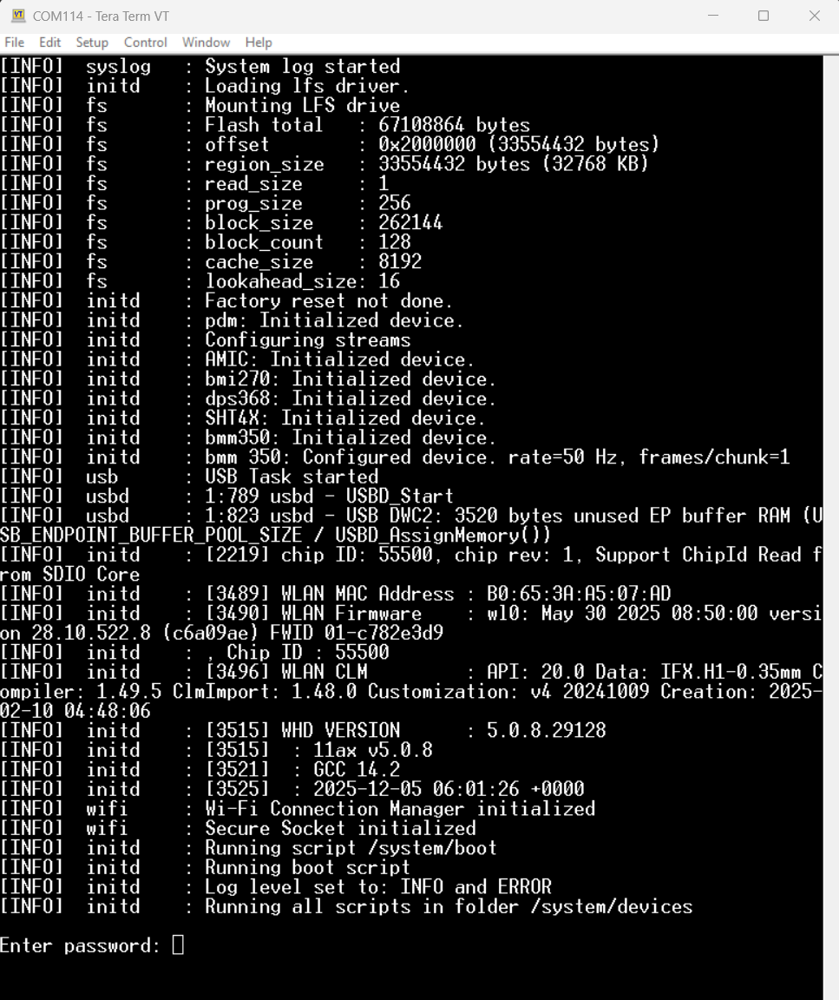
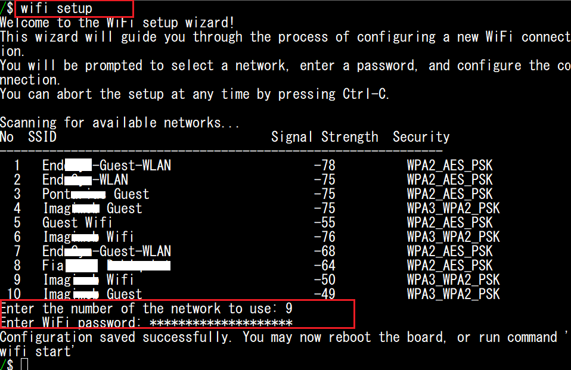
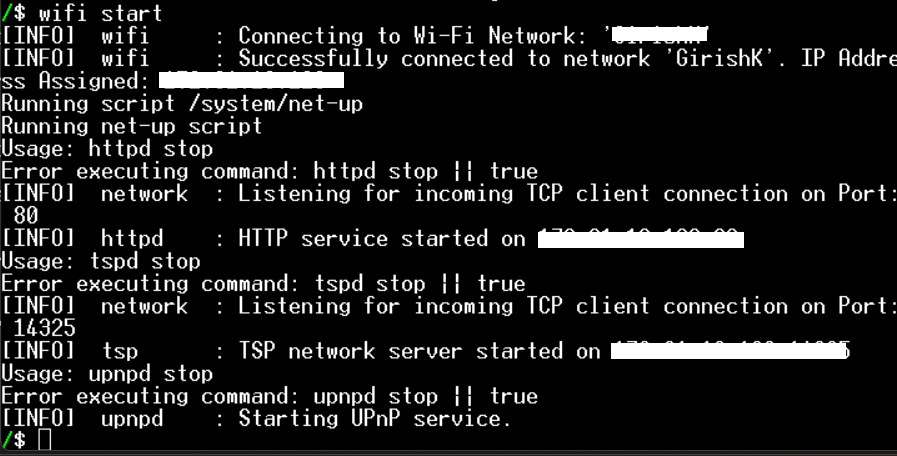
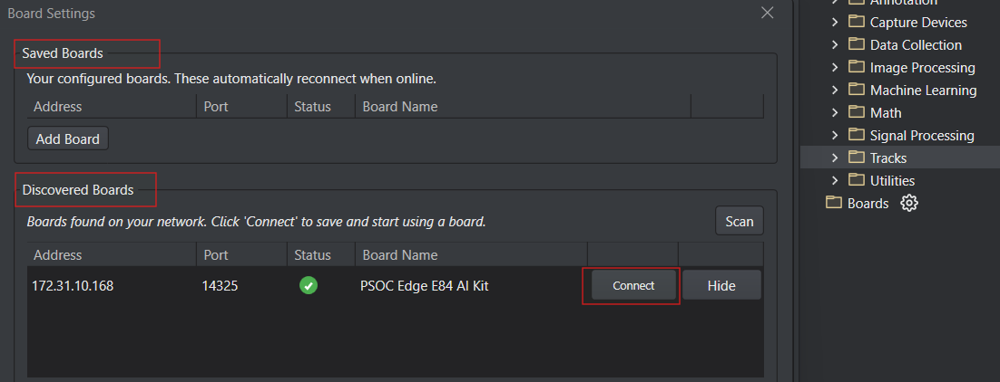
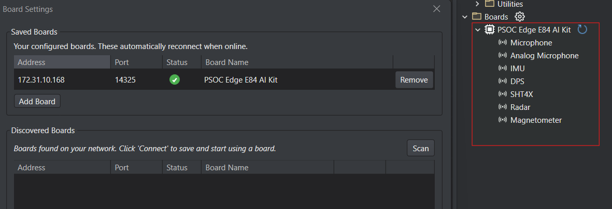

# PSOC&trade; Edge MCU: Machine learning – DEEPCRAFT&trade; data collection

This code example demonstrates how to collect data by implementing the [DEEPCRAFT&trade; streaming protocol v2](https://developer.imagimob.com/getting-started/tensor-streaming-protocol/registering-sensors-using-protocolv2) for PSOC&trade; Edge E84 MCU boards, allowing the streaming of sensor data and other information from the board into [DEEPCRAFT&trade; Studio](https://www.imagimob.com/products) over USB and Wi-Fi for development and testing of Edge AI models.

The code example supports collecting data from different sources utilizing the Cortex&reg;-M55 (CM55) CPU. Data can be collected from an inertial measurement unit (IMU - BMI270), magnetometer (BMM350), XENSIV&trade; digital MEMS microphones (IM73D122V01) using pulse-density modulation (PDM) to pulse-code modulation (PCM), analog microphone (IM73A135V01XTSA1), XENSIV&trade; digital barometric air pressure sensor (DPS368), digital humidity and temperature sensor (SHT40), and XENSIV&trade; 60 GHz radar sensor (BGT60TR13C). The data is transmitted using USB to [DEEPCRAFT&trade; Studio](https://www.imagimob.com/products). The data can then be used in [DEEPCRAFT&trade; starter projects](https://developer.imagimob.com/getting-started/starter-project) or to generate a new model.

To deploy a DEEPCRAFT&trade; model to an Infineon embedded device, see the following code examples:

- [mtb-example-psoc-edge-ml-deepcraft-deploy-audio](https://github.com/Infineon/mtb-example-psoc-edge-ml-deepcraft-deploy-audio)
- [mtb-example-psoc-edge-ml-deepcraft-deploy-motion](https://github.com/Infineon/mtb-example-psoc-edge-ml-deepcraft-deploy-motion)
- [mtb-example-psoc-edge-ml-deepcraft-deploy-radar](https://github.com/Infineon/mtb-example-psoc-edge-ml-deepcraft-deploy-radar)

This code example has a three project structure: CM33 secure, CM33 non-secure, and CM55 projects. All three projects are programmed to the external QSPI flash and executed in Execute in Place (XIP) mode. Extended boot launches the CM33 secure project from a fixed location in the external flash, which then configures the protection settings and launches the CM33 non-secure application. Additionally, CM33 non-secure application enables CM55 CPU and launches the CM55 application.
> **Note:** On the KIT_PSE84_HMI, all three projects are programmed to the external OSPI flash instead of QSPI.

> **Note:** DEEPCRAFT&trade; Studio currently support only the Windows system.

[View this README on GitHub.](https://github.com/Infineon/mtb-example-psoc-edge-ml-deepcraft-data-collection)

[Provide feedback on this code example.](https://yourvoice.infineon.com/jfe/form/SV_1NTns53sK2yiljn?Q_EED=eyJVbmlxdWUgRG9jIElkIjoiQ0UyMzkyNDciLCJTcGVjIE51bWJlciI6IjAwMi0zOTI0NyIsIkRvYyBUaXRsZSI6IlBTT0MmdHJhZGU7IEVkZ2UgTUNVOiBNYWNoaW5lIGxlYXJuaW5nIOKAkyBERUVQQ1JBRlQmdHJhZGU7IGRhdGEgY29sbGVjdGlvbiIsInJpZCI6Im5pY2hvbGFzLnNoYXJwQGluZmluZW9uLmNvbSIsIkRvYyB2ZXJzaW9uIjoiMy4xLjAiLCJEb2MgTGFuZ3VhZ2UiOiJFbmdsaXNoIiwiRG9jIERpdmlzaW9uIjoiTUNEIiwiRG9jIEJVIjoiSUNXIiwiRG9jIEZhbWlseSI6IlBTT0MifQ==)

See the [Design and implementation](docs/design_and_implementation.md) for the functional description of this code example.


## Requirements

- [ModusToolbox&trade;](https://www.infineon.com/modustoolbox) v3.7 or later (tested with v3.7)
- Board support package (BSP) minimum required version: 1.0.0
- Programming language: C
- Associated parts: All [PSOC&trade; Edge MCU](https://www.infineon.com/products/microcontroller/32-bit-psoc-arm-cortex/32-bit-psoc-edge-arm) parts


## Supported toolchains (make variable 'TOOLCHAIN')

- GNU Arm&reg; Embedded Compiler v14.2.1 (`GCC_ARM`) – Default value of `TOOLCHAIN`


## Supported kits (make variable 'TARGET')

- [PSOC&trade; Edge E84 AI Kit](https://www.infineon.com/KIT_PSE84_AI) (`KIT_PSE84_AI`) – Default value of `TARGET`
- [PSOC&trade; Edge E84 Evaluation Kit](https://www.infineon.com/KIT_PSE84_EVAL) (`KIT_PSE84_EVAL_EPC2`)
- [PSOC&trade; Edge E84 Evaluation Kit](https://www.infineon.com/KIT_PSE84_EVAL) (`KIT_PSE84_EVAL_EPC4`)
- [PSOC&trade; Edge E84 HMI Kit](https://www.infineon.com/KIT_PSE84_HMI) (`KIT_PSE84_HMI`)


## Hardware setup

This example uses the board's default configuration. See the kit user guide to ensure that the board is configured correctly.

Ensure the following jumper and pin configuration on board.
- BOOT SW must be in the HIGH/ON position
- J20 and J21 must be in the tristate/not connected (NC) position for the PSOC&trade; Edge E84 Evaluation Kit

> **Note:** This hardware setup is not required for the `KIT_PSE84_AI` kit.


### USB connection to DEEPCRAFT&trade; Studio for data transfer

Connect USB-C cable to USB connector as follows:

**Table 1. USB Connector Mapping for PSE84 kits**

 Kit  |  USB connector
:-------- | :-------------
`KIT_PSE84_AI` | J2
`KIT_PSE84_HMI` | J3
`KIT_PSE84_EVAL_EPC2` | J30
`KIT_PSE84_EVAL_EPC4` | J30

<br>


## Software setup

See the [ModusToolbox&trade; tools package installation guide](https://www.infineon.com/ModusToolboxInstallguide) for information about installing and configuring the tools package.

- Install [DEEPCRAFT&trade; Studio](https://www.imagimob.com/studio) if not already installed
- Install a terminal emulator if you do not have one. Instructions in this document use [Tera Term](https://teratermproject.github.io/index-en.html)


## Operation

See [Using the code example](docs/using_the_code_example.md) for instructions on creating a project, opening it in various supported IDEs, and performing tasks, such as building, programming, and debugging the application within the respective IDEs.

1. Connect the board to your PC using the provided USB cable through the KitProg3 USB connector

2. Open a terminal program and select the KitProg3 COM port. Set the serial port parameters to 8N1 and 115200 baud

3. After programming, the application starts automatically. Confirm that "System log started" is displayed on the UART terminal

   **Figure 1. Terminal output on program startup**

   

4. Ensure that the power LED1 turns ON, indicating the board is powered
5.  When prompted, login to the shell using the default password:

   ```
   imagimob
   ```
   > **Note:** It is recommended to change the default password after first login using the `passwd` command

### Option 1: Connect DEEPCRAFT&trade; Studio over USB

Connect DEEPCRAFT&trade; Studio to the board using a USB cable for direct, cable-based sensor data collection.

1. Connect the USB-device port on the board to the host PC using a USB cable, which enables a serial port for sensor data collection. See [USB connection details in hardware setup](#hardware-setup)

2. LED1 Will be blinking until the USB is connected. On sucessfully USB connection LED1 will be solid ON.

   > **Note:** Ignore any Wi-Fi related commands on the terminal; no further action is needed to do data collection over USB. Open DEEPCRAFT Studio&trade; -> **Node Explorer** -> **Boards**, your connected board with available sensors will be visible

### Option 2: Connect DEEPCRAFT&trade; Studio over Wi-Fi

Connect DEEPCRAFT&trade; Studio to the board wirelessly using the Tensor Streaming Protocol (TSP) over Wi-Fi. This allows cable-free sensor data collection as long as both the host PC and the board are on the same network.
#### Step 1: Setup and start Wi-Fi streaming on the board

1. Connect to the KitProg3 UART terminal (see **Step 2** in the [Operation section](#operation) above)

2. In console, configure Wi-Fi by running:

   ```
   wifi setup
   ```

   Press Enter. All the available Wi-Fi network appears. In **Enter the number of the network to use**, type the number of the Wi-Fi network you want to connect for streaming the data from your board to studio. In **Enter Wi-Fi password**, type the password of the Wi-Fi.The credentials are saved to `/system/wifi` and loaded automatically on every subsequent boot

      **Figure 2. Terminal output Wi-Fi setup**

   

3. Start the Wi-Fi connection immediately (without rebooting) by running:

   ```
   wifi start
   ```

   The Wi-Fi LED (LED2) turns ON when the connection is established and an IP address is acquired. The board's IP address is shown in the terminal output

      **Figure 3. Terminal output Wi-Fi start**

   

4. The Tensor Streaming Protocol (TSP) server starts automatically on **port 14325** once the network is up

   > **Note:**  In case you have multiple boards, to change the default board name, use the command **set_boardname**. If there are spaces in the name of the board, write the name between quotes. (This is an optional step)

    <br> For example, Setting default board name to "board 1"
   ```
   set_boardname "board 1"
   ```

#### Step 2: Select the board in Studio to start streaming

   > **Note:** Both the host PC and the board must be on the same network.

   > **Note:** If your PC's network is set to Public, Windows will block many outbound ports. To resolve this, change the network setting to Private by going to: Settings → Network & Internet → Wi-Fi → your network → Set to Private.

1. Open **DEEPCRAFT Studio&trade; -> Node Explorer** and click **settings icon** next to Boards. The Board Settings window appears

      **Figure 4. Available board on the Wi-Fi network**

      

2. Under **Discovered Boards**, which displays all the boards available on the Wi-Fi network, find your board and click **Connect** .The board now appears under **Saved Boards**, which displays the boards you can select to stream data into studio. The green icon indicates that the board is connected to Wi-Fi and is ready to stream data. The red icon indicates that the board is not connected to Wi-Fi

3. After you connect the board, the board name along with all the sensors present on the board appears under the **Boards** in the **Node Explorer**.

      **Figure 5. Available board with sensors**

      

### Data collection with DEEPCRAFT&trade; Studio

**Table 2. Sensors available on kit**

Kit  |  Available sensors
:-------- | :-------------
`KIT_PSE84_AI` | Inertial measurement unit (BMI270), magnetometer (BMM350), XENSIV&trade; digital MEMS microphones (IM73D122V01), analog microphone (IM73A135V01XTSA1), XENSIV&trade; digital barometric air pressure sensor (DPS368), digital humidity and temperature sensor (SHT40), and XENSIV&trade; 60 GHz radar sensor (BGT60TR13C)
`KIT_PSE84_HMI` | Inertial measurement unit (BMI270), XENSIV&trade; digital MEMS microphones (IM73D122V01), analog microphone (IM73A135V01XTSA1), digital humidity and temperature sensor (SHT40), and XENSIV&trade; 60 GHz radar sensor (BGT60TR13C)
`KIT_PSE84_EVAL_EPC2` | Inertial measurement unit (BMI270), magnetometer (BMM350), XENSIV&trade; digital MEMS microphones (IM73D122V01), analog microphone (IM73A135V01XTSA1)
`KIT_PSE84_EVAL_EPC4` | Inertial measurement unit (BMI270), magnetometer (BMM350), XENSIV&trade; digital MEMS microphones (IM73D122V01), analog microphone (IM73A135V01XTSA1)

> **Note:** <br>
      For step-by-step instructions on collecting data on `KIT_PSE84_AI`, `KIT_PSE84_EVAL_EPC2` / `KIT_PSE84_EVAL_EPC4` and `KIT_PSE84_HMI` kit, see DEEPCRAFT&trade; Studio getting started section for [KIT_PSE84_AI](https://developer.imagimob.com/deepcraft-studio/getting-started/infineon-boards/psoc-edge-e84-ai-kit) , [ KIT_PSE84_EVAL_EPC2/EPC4](https://developer.imagimob.com/deepcraft-studio/getting-started/infineon-boards/psoc-edge-e84-eval-kit), [KIT_PSE84_HMI](https://developer.imagimob.com/deepcraft-studio/getting-started/infineon-boards/psoc-edge-e84-hmi-kit) kit respectively. <br>


> **Note:**
    To ensure the optimal performance and the data integrity when working with sensors, consider the following guidelines:<br>
    <b>1. Enabling Sensors:</b> When enabling all sensors simultaneously, it is recommended to initialize them with their default frequency or minimum frequency. This helps prevent potential data loss due to excessive data streams. By starting with a minimal data frequency, you can ensure that the DEEPCRAFT&trade; Studio runs smoothly.<br>
    <b>2. Sensor Readings:</b>
    <br> a. The sensor readings are relative to the board temperature and not relative to the ambient temperature. Since KIT_PSE84_AI has a smaller form-factor, it generates more heat on the board compared to KIT_PSE84_EVAL_EPC2 / KIT_PSE84_EVAL_EPC4. Therefore, you may notice a slight difference in the sensor readings between these kits. Care must be taken when porting the models across the boards to compensate any deviation in the sensor readings.
    <br> b. By default, the orientation of the BMI270 and BMM350 sensors is aligned with the PSOC&trade; 6 AI Evaluation Kit (CY8CKIT-062S2-AI). To disable this alignment, set the `SENSOR_REMAPPING` macro to `DISABLED` in the common.mk file.


## Status LED codes


### Normal operation

The status LED1 indicates normal operation by flashing each time data is sent. If data is being sent at a high frequency, the LED may appear dimmed due to the rapid flashing.


### Error indication

In the event of an error, the LED1 will flash a specific error code. Each flash pattern consists of short and long flashes:
- A short flash (noted as `.`) lasts 100 milliseconds
- A long flash (noted as `-`) lasts 300 milliseconds

The sequence repeats after a delay of 3 seconds.


### Error code patterns

**Table 3. Error code patterns**

Pattern  |  Error description
:-------- | :-------------
`-    (repeated without pause)`| The wrong USB port is connected or failed to establish USB connection. Check the USB cable
`-.   (pause, repeated)`| Unspecified error
`.-   (pause, repeated)`| UART error. Data communication error
`-..  (pause, repeated)`| I2C bus error
`.-.  (pause, repeated)`| Memory error
`--.  (pause, repeated)`| Debug console error
`..-  (pause, repeated)`| Clock error
`-.-  (pause, repeated)`| SPI bus error
`.--  (pause, repeated)`| Watchdog error
`-... (pause, repeated)`| Microphone error
`.-.. (pause, repeated)`| IMU error (problem with the BMI270 chip)
`--.. (pause, repeated)`| Magnetometer error (problem with the BMM350 chip)
`..-. (pause, repeated)`| Digital pressure/temperature sensor error (problem with the DPS368 chip)
`-.-. (pause, repeated)`| Radar error (problem with the BGT60TRxx chip)
`.--. (pause, repeated)`| Humidity sensor error (problem with the SHT40 chip)
`---. (pause, repeated)`| Analog microphone error
`-..- (pause, repeated)`| I3C bus error


## Related resources

Resources  | Links
-----------|----------------------------------
Application notes  | [AN235935](https://www.infineon.com/AN235935) – Getting started with PSOC&trade; Edge E8 MCU on ModusToolbox&trade; software
Code examples  | [Using ModusToolbox&trade;](https://github.com/Infineon/Code-Examples-for-ModusToolbox-Software) on GitHub
Device documentation | [PSOC&trade; Edge MCU datasheets](https://www.infineon.com/products/microcontroller/32-bit-psoc-arm-cortex/32-bit-psoc-edge-arm#documents) <br> [PSOC&trade; Edge MCU reference manuals](https://www.infineon.com/products/microcontroller/32-bit-psoc-arm-cortex/32-bit-psoc-edge-arm#documents)
Development kits | Select your kits from the [Evaluation board finder](https://www.infineon.com/cms/en/design-support/finder-selection-tools/product-finder/evaluation-board)
Libraries  | [mtb-dsl-pse8xxgp](https://github.com/Infineon/mtb-dsl-pse8xxgp) – Device support library for PSE8XXGP <br> [retarget-io](https://github.com/Infineon/retarget-io) – Utility library to retarget STDIO messages to a UART port
Tools  | [ModusToolbox&trade;](https://www.infineon.com/modustoolbox) – ModusToolbox&trade; software is a collection of easy-to-use libraries and tools enabling rapid development with Infineon MCUs for applications ranging from wireless and cloud-connected systems, edge AI/ML, embedded sense and control, to wired USB connectivity using PSOC&trade; Industrial/IoT MCUs, AIROC&trade; Wi-Fi and Bluetooth&reg; connectivity devices, XMC&trade; Industrial MCUs, and EZ-USB&trade;/EZ-PD&trade; wired connectivity controllers. ModusToolbox&trade; incorporates a comprehensive set of BSPs, HAL, libraries, configuration tools, and provides support for industry-standard IDEs to fast-track your embedded application development

<br>


## Other resources

Infineon provides a wealth of data at [www.infineon.com](https://www.infineon.com) to help you select the right device, and quickly and effectively integrate it into your design.


## Document history

Document title: *CE239247* – *PSOC&trade; Edge MCU: Machine learning – DEEPCRAFT&trade; data collection*

 Version | Description of change
 ------- | ---------------------
 1.x.0   | New code example <br> Early access release
 2.0.0   | GitHub release <br>
 2.1.0   | Enabled selection of either pressure or temperature or both data while streaming DPS368 sensor data <br>Added support for SHT40 Sensor
 2.2.0   | Aligned BMI270 and BMM350 sensor orientation with PSOC&trade; 6 AI Evaluation Kit (CY8CKIT-062S2-AI)
 2.3.0   | Updated design files to fix ModusToolbox&trade; v3.7 build warnings
 3.0.0   | Added Wi-Fi capability <br> Added support for Analog microphone
 3.1.0   | Added support for KIT_PSE84_HMI<br> Added Support for SSIDs with spaces, apostrophes, and UTF-8 characters


All referenced product or service names and trademarks are the property of their respective owners.

The Bluetooth&reg; word mark and logos are registered trademarks owned by Bluetooth SIG, Inc., and any use of such marks by Infineon is under license.

PSOC&trade;, formerly known as PSoC&trade;, is a trademark of Infineon Technologies. Any references to PSoC&trade; in this document or others shall be deemed to refer to PSOC&trade;.

---------------------------------------------------------

(c) 2026, Infineon Technologies AG, or an affiliate of Infineon Technologies AG. All rights reserved.
This software, associated documentation and materials ("Software") is owned by Infineon Technologies AG or one of its affiliates ("Infineon") and is protected by and subject to worldwide patent protection, worldwide copyright laws, and international treaty provisions. Therefore, you may use this Software only as provided in the license agreement accompanying the software package from which you obtained this Software. If no license agreement applies, then any use, reproduction, modification, translation, or compilation of this Software is prohibited without the express written permission of Infineon.
<br>
Disclaimer: UNLESS OTHERWISE EXPRESSLY AGREED WITH INFINEON, THIS SOFTWARE IS PROVIDED AS-IS, WITH NO WARRANTY OF ANY KIND, EXPRESS OR IMPLIED, INCLUDING, BUT NOT LIMITED TO, ALL WARRANTIES OF NON-INFRINGEMENT OF THIRD-PARTY RIGHTS AND IMPLIED WARRANTIES SUCH AS WARRANTIES OF FITNESS FOR A SPECIFIC USE/PURPOSE OR MERCHANTABILITY. Infineon reserves the right to make changes to the Software without notice. You are responsible for properly designing, programming, and testing the functionality and safety of your intended application of the Software, as well as complying with any legal requirements related to its use. Infineon does not guarantee that the Software will be free from intrusion, data theft or loss, or other breaches (“Security Breaches”), and Infineon shall have no liability arising out of any Security Breaches. Unless otherwise explicitly approved by Infineon, the Software may not be used in any application where a failure of the Product or any consequences of the use thereof can reasonably be expected to result in personal injury.
